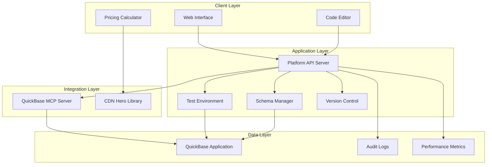
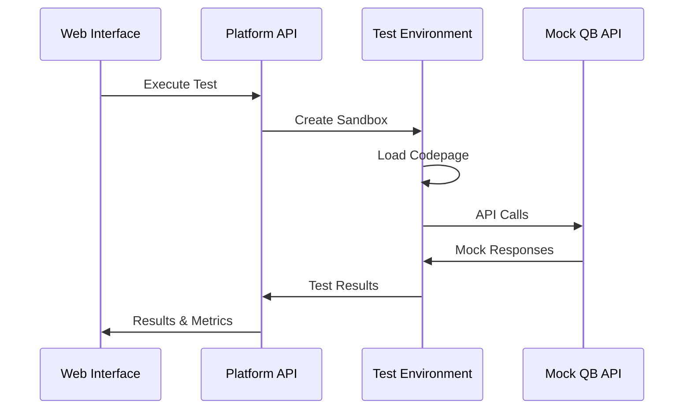
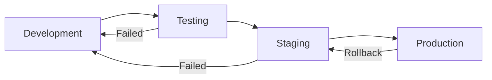

# Design Document

## Overview

The QuickBase Codepage Development Platform is a web-based development environment that enables car dealership staff to create, test, and deploy QuickBase codepages with minimal technical expertise. The platform leverages the existing QuickBase MCP Server and CDN Hero library to provide a comprehensive solution for building interactive business applications like pricing calculators.

The system follows a modular architecture with clear separation between the development environment, testing sandbox, schema management, and deployment components. It provides both a user-friendly interface for non-technical users and advanced features for developers.

## Architecture

### High-Level Architecture



### Component Architecture

The platform consists of five main components:

1. **Web Development Interface** - React-based frontend for codepage development
2. **Platform API Server** - Node.js/Express backend handling business logic
3. **Test Environment** - Sandboxed execution environment for codepage testing
4. **Schema Manager** - QuickBase application structure management
5. **Deployment Pipeline** - Automated codepage deployment and version control

## Components and Interfaces

### 1. Web Development Interface

**Technology Stack:**
- React 18 with TypeScript
- Monaco Editor for code editing
- Material-UI for component library
- React Query for state management

**Key Features:**
- Syntax-highlighted JavaScript editor with QuickBase API autocomplete
- Template library with pre-built codepage patterns
- Real-time collaboration with conflict resolution
- Integrated testing controls and result visualization

**API Interface:**
```typescript
interface CodepageAPI {
  // Codepage management
  createCodepage(template: string, name: string): Promise<CodepageProject>
  saveCodepage(id: string, code: string): Promise<void>
  getCodepage(id: string): Promise<CodepageProject>
  
  // Testing
  testCodepage(id: string, testData: any): Promise<TestResult>
  
  // Templates
  getTemplates(): Promise<Template[]>
  createTemplate(template: Template): Promise<string>
}
```

### 2. Platform API Server

**Technology Stack:**
- Node.js with Express and TypeScript
- JWT authentication with role-based access
- WebSocket support for real-time collaboration
- Redis for session management and caching

**Core Services:**

**Codepage Service:**
```typescript
class CodepageService {
  async createProject(userId: string, template: string): Promise<Project>
  async saveCode(projectId: string, code: string, userId: string): Promise<Version>
  async deployCodepage(projectId: string, environment: string): Promise<Deployment>
  async getProjectHistory(projectId: string): Promise<Version[]>
}
```

**Template Service:**
```typescript
class TemplateService {
  async getPricingCalculatorTemplate(): Promise<Template>
  async getInventoryManagerTemplate(): Promise<Template>
  async getCustomerFormTemplate(): Promise<Template>
  async createCustomTemplate(template: Template): Promise<string>
}
```

### 3. Test Environment

**Architecture:**
- Docker containers for isolated code execution
- VM2 library for secure JavaScript sandboxing
- Mock QuickBase API for safe testing
- Performance monitoring and resource limits

**Test Execution Flow:**


**Test Configuration:**
```typescript
interface TestConfig {
  timeout: number;           // 30 seconds max
  memoryLimit: string;       // 128MB max
  mockData: MockDataSet;     // Test data fixtures
  apiCallLimit: number;      // Max 100 API calls per test
}
```

### 4. Schema Manager

**Responsibilities:**
- QuickBase table and field management via MCP Server
- Relationship validation and integrity checking
- Schema change tracking and rollback capabilities
- Data migration support for schema updates

**Schema Operations:**
```typescript
interface SchemaManager {
  // Table operations
  createTable(definition: TableDefinition): Promise<string>
  updateTable(tableId: string, changes: TableChanges): Promise<void>
  deleteTable(tableId: string): Promise<void>
  
  // Field operations
  createField(tableId: string, field: FieldDefinition): Promise<number>
  updateField(tableId: string, fieldId: number, changes: FieldChanges): Promise<void>
  
  // Relationship operations
  createRelationship(parent: string, child: string, config: RelationshipConfig): Promise<void>
  validateRelationships(tableId: string): Promise<ValidationResult>
}
```

### 5. Deployment Pipeline

**Features:**
- Automated codepage deployment to QuickBase
- Environment management (development, staging, production)
- Rollback capabilities with version history
- Performance monitoring and alerting

**Deployment Process:**


## Data Models

### Core Data Models

**Project Model:**
```typescript
interface CodepageProject {
  id: string;
  name: string;
  description: string;
  templateId: string;
  ownerId: string;
  collaborators: string[];
  currentVersion: string;
  status: 'development' | 'testing' | 'deployed';
  createdAt: Date;
  updatedAt: Date;
}
```

**Version Model:**
```typescript
interface CodepageVersion {
  id: string;
  projectId: string;
  versionNumber: string;
  code: string;
  changelog: string;
  authorId: string;
  testResults?: TestResult;
  deploymentStatus: 'pending' | 'deployed' | 'failed';
  createdAt: Date;
}
```

**Template Model:**
```typescript
interface CodepageTemplate {
  id: string;
  name: string;
  description: string;
  category: 'calculator' | 'form' | 'dashboard' | 'utility';
  code: string;
  dependencies: string[];
  configSchema: JSONSchema;
  isPublic: boolean;
  authorId: string;
}
```

**Test Result Model:**
```typescript
interface TestResult {
  id: string;
  projectId: string;
  versionId: string;
  status: 'passed' | 'failed' | 'error';
  executionTime: number;
  memoryUsage: number;
  apiCallCount: number;
  errors: TestError[];
  coverage: TestCoverage;
  performanceMetrics: PerformanceMetrics;
}
```

### QuickBase Schema Models

**Table Definition:**
```typescript
interface TableDefinition {
  name: string;
  description: string;
  fields: FieldDefinition[];
  relationships: RelationshipDefinition[];
  permissions: PermissionSet;
}
```

**Field Definition:**
```typescript
interface FieldDefinition {
  label: string;
  fieldType: QuickBaseFieldType;
  required: boolean;
  unique: boolean;
  defaultValue?: any;
  validation?: ValidationRule[];
  choices?: string[];
  formula?: string;
}
```

## Error Handling

### Error Categories

1. **Validation Errors** - Invalid input data or configuration
2. **Authentication Errors** - Invalid credentials or expired sessions
3. **QuickBase API Errors** - Upstream API failures or rate limiting
4. **Execution Errors** - Codepage runtime errors or timeouts
5. **System Errors** - Infrastructure failures or resource exhaustion

### Error Response Format

```typescript
interface ErrorResponse {
  error: {
    code: string;
    message: string;
    details?: any;
    timestamp: string;
    requestId: string;
  };
}
```

### Error Handling Strategy

**Client-Side:**
- Graceful degradation with user-friendly error messages
- Retry mechanisms for transient failures
- Offline capability with local storage fallback

**Server-Side:**
- Structured logging with correlation IDs
- Circuit breaker pattern for external API calls
- Dead letter queues for failed operations

**QuickBase Integration:**
- Exponential backoff for rate-limited requests
- Fallback to cached data when possible
- Health checks and automatic failover

## Testing Strategy

### Testing Pyramid

**Unit Tests (70%):**
- Individual component functionality
- Business logic validation
- Data model operations
- Utility functions

**Integration Tests (20%):**
- API endpoint testing
- Database operations
- QuickBase MCP integration
- Authentication flows

**End-to-End Tests (10%):**
- Complete user workflows
- Cross-browser compatibility
- Performance benchmarks
- Security validation

### Test Environment Setup

**Mock Services:**
```typescript
interface MockQuickBaseAPI {
  mockTableOperations(): void;
  mockFieldOperations(): void;
  mockRecordOperations(): void;
  simulateLatency(ms: number): void;
  simulateErrors(errorRate: number): void;
}
```

**Test Data Management:**
- Fixture files for consistent test data
- Database seeding for integration tests
- Snapshot testing for UI components
- Performance baseline tracking

### Continuous Testing

**Automated Test Execution:**
- Pre-commit hooks for unit tests
- Pull request validation with full test suite
- Nightly integration test runs
- Performance regression testing

**Test Reporting:**
- Coverage reports with minimum thresholds
- Performance metrics tracking
- Security vulnerability scanning
- Accessibility compliance testing

## Security Considerations

### Authentication & Authorization

**Multi-Factor Authentication:**
- TOTP-based 2FA for admin users
- SSO integration with dealership systems
- Session management with automatic timeout

**Role-Based Access Control:**
```typescript
enum UserRole {
  ADMIN = 'admin',           // Full system access
  DEVELOPER = 'developer',   // Codepage development
  MANAGER = 'manager',       // Schema management
  USER = 'user'             // Read-only access
}
```

### Data Protection

**Encryption:**
- TLS 1.3 for all communications
- AES-256 encryption for sensitive data at rest
- Key rotation with AWS KMS integration

**Data Validation:**
- Input sanitization for all user inputs
- SQL injection prevention
- XSS protection with Content Security Policy

### Codepage Security

**Sandbox Execution:**
- VM2 isolation for codepage execution
- Resource limits (CPU, memory, network)
- API call restrictions and rate limiting

**Code Review:**
- Automated security scanning for codepages
- Manual review process for production deployments
- Vulnerability database integration

## Performance Optimization

### Caching Strategy

**Multi-Level Caching:**
- Browser cache for static assets
- Redis cache for API responses
- CDN caching for global distribution

**Cache Invalidation:**
- Time-based expiration for dynamic data
- Event-driven invalidation for schema changes
- Manual cache clearing for emergency updates

### Database Optimization

**Query Optimization:**
- Indexed queries for common operations
- Connection pooling for database access
- Read replicas for reporting queries

**Data Archiving:**
- Automated archiving of old versions
- Compressed storage for historical data
- Purge policies for temporary data

### Monitoring & Alerting

**Performance Metrics:**
- Response time monitoring
- Error rate tracking
- Resource utilization alerts
- User experience metrics

**Business Metrics:**
- Codepage usage statistics
- Feature adoption rates
- User satisfaction scores
- System reliability metrics